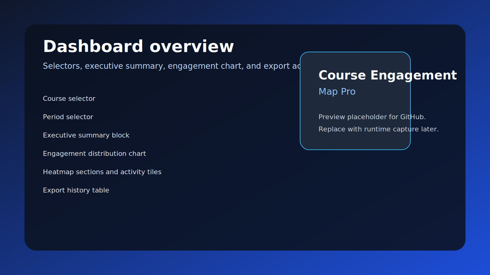
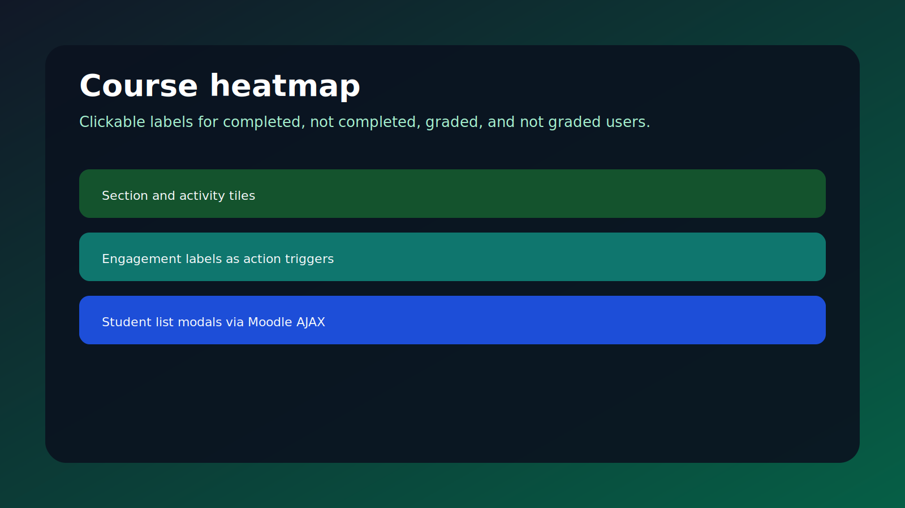
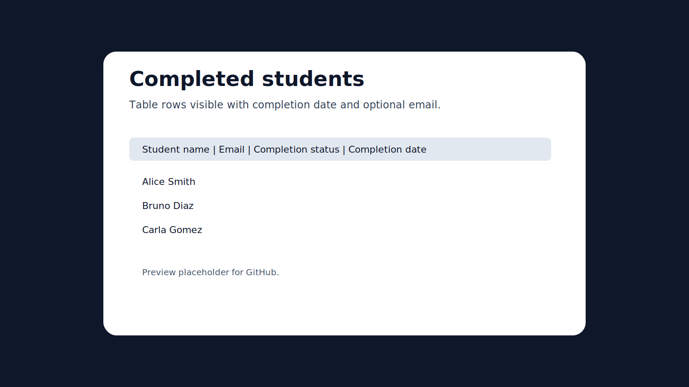
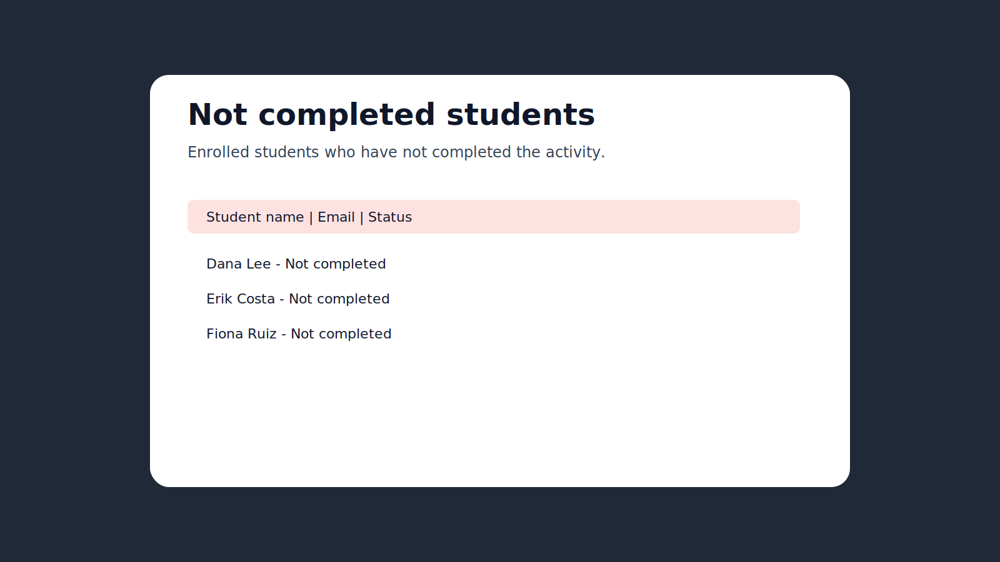
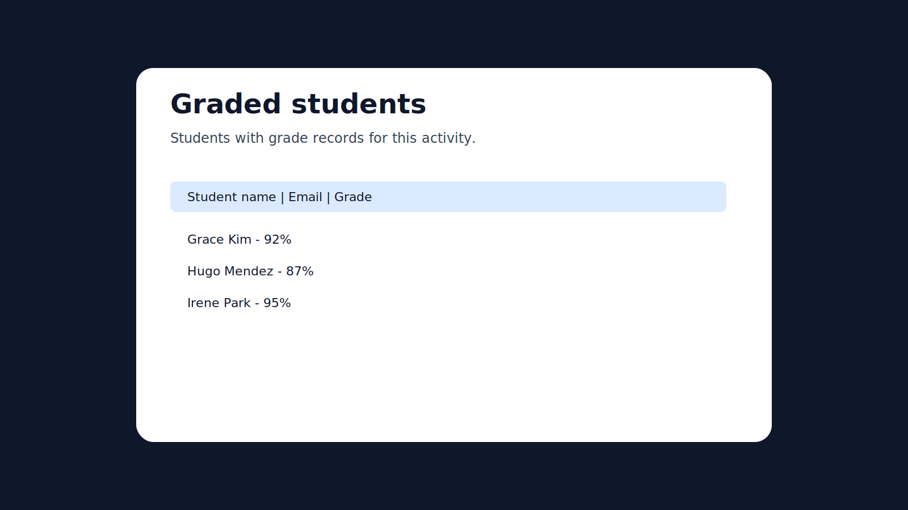
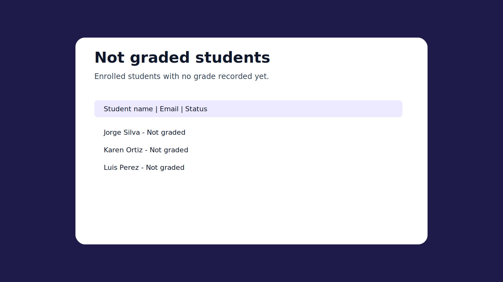
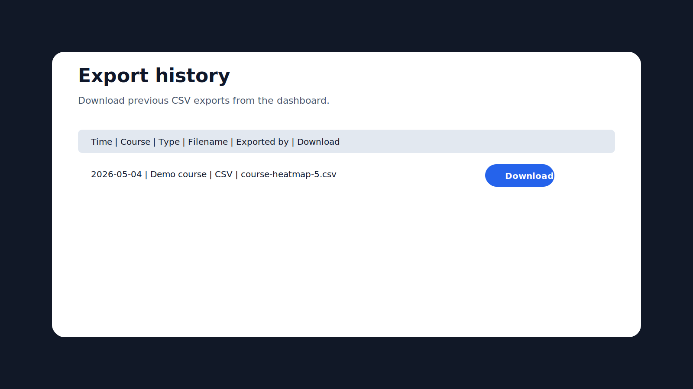
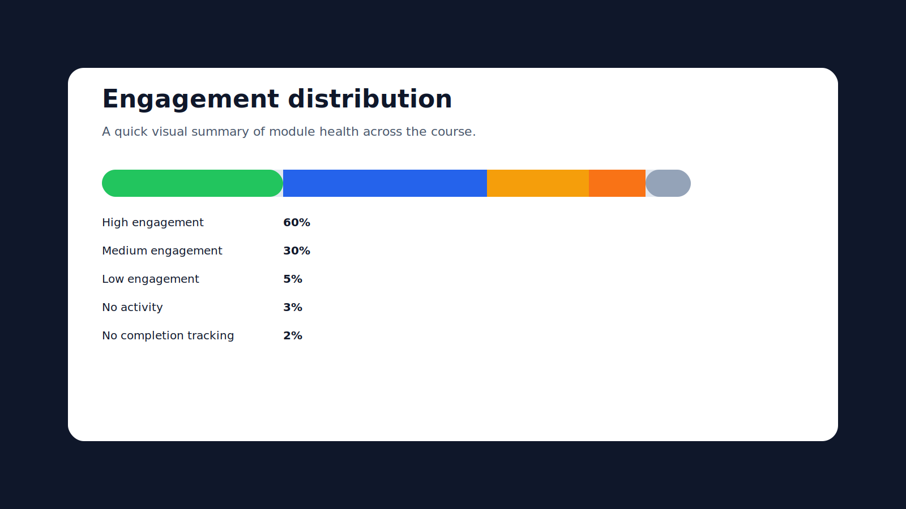

# Course Engagement Map Pro

Course Engagement Map Pro is a Moodle `local` plugin that visualizes course engagement with section and activity heatmaps.

Product page: https://edtech.kaviratech.com/moodle-suite/course-heat-map
GitHub repository: https://github.com/antoniomexdf-boop/moodle-local_courseheatmappro.git

## Features

- Course selector and period selector
- Section-level heatmap
- Activity-level heatmap
- Engagement summary
- Clickable completed and graded user counts with Moodle modals
- CSV export by course
- Moodle 4.1+ compatibility

## Data sources

The plugin reads Moodle-native course data at runtime. It does not create its own persistent analytics tables in v1.

Primary sources:

- course
- course_sections
- course_modules
- course_modules_completion
- modules
- enrol
- user_enrolments
- role_assignments
- context
- user_lastaccess
- grade_items
- grade_grades

If a metric cannot be derived from the safe Moodle tables listed above, it is marked as not available in v1.

## Installation

1. Copy the `courseheatmappro` folder into `moodle/local/`.
2. Visit the Moodle notifications page to install or upgrade the plugin.
3. Open `Site administration > Reports > Course Engagement Map Pro`, or go directly to `/local/courseheatmappro/index.php`.
4. Select a course and period, then click `View heatmap`.

## Compliance notes

- English-only submission package
- No inline JavaScript
- No manual stylesheet enqueue for `styles.css`
- Mustache templates plus Output API are used for rendering
- Privacy provider covers the export history table in v1
- GitHub Actions with `moodle-plugin-ci` is included from the start

## Screenshots

The repository-ready screenshot set is prepared in `screenshots/` under the plugin root and embedded below for GitHub visibility.

Recommended file names:

- `01-dashboard-overview.svg`
- `02-course-heatmap.svg`
- `03-completed-users-modal.svg`
- `04-not-completed-users-modal.svg`
- `05-graded-users-modal.svg`
- `06-not-graded-users-modal.svg`
- `07-export-history.svg`
- `08-engagement-distribution.svg`

These previews can be replaced with real runtime captures from `/Applications/MAMP/htdocs/moodle/local/courseheatmappro` before packaging if needed.

### Preview Set

